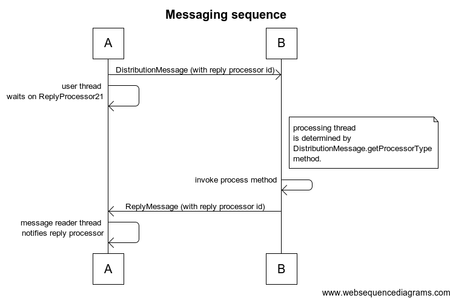
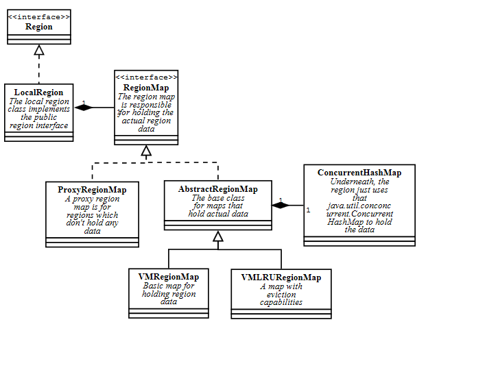
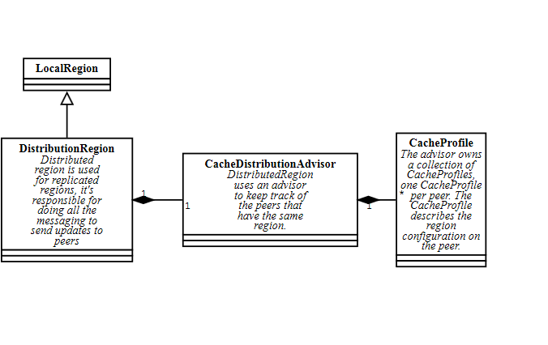
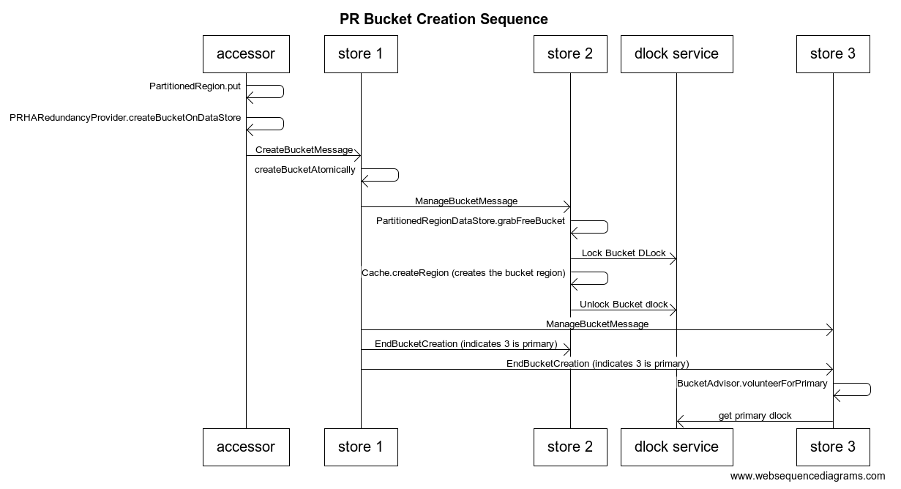
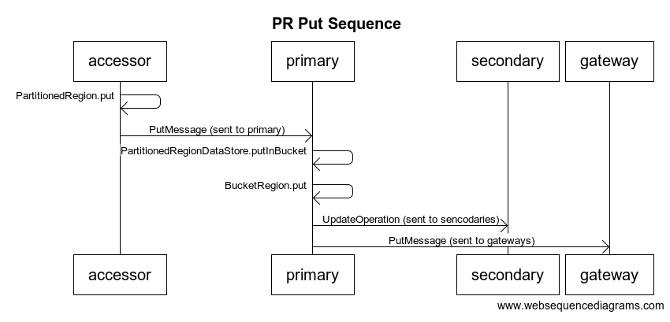
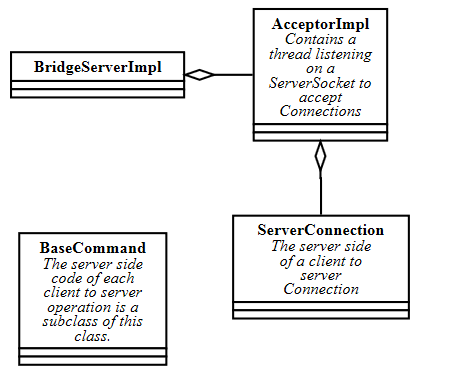
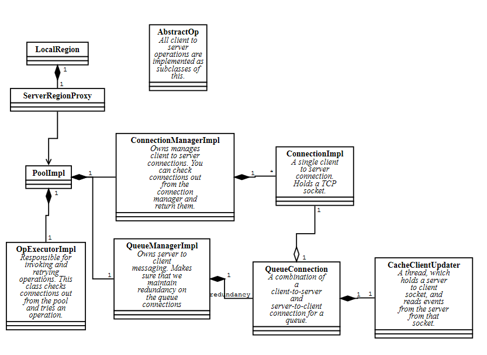
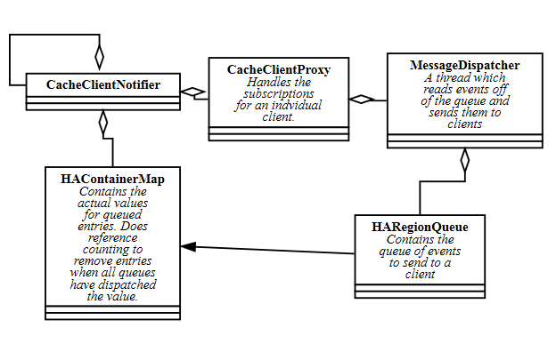
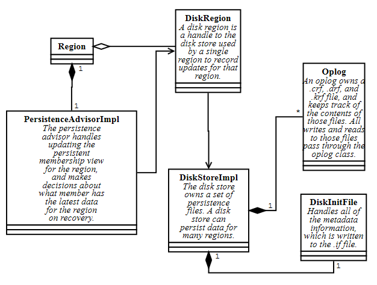

# Distributed System and Messaging

The core of geode is a few singletons

* InternalDistributedSystem - this is the singleton that manages the connection to the distributed system

* LonerDistributionManager, DistributionManager - InternalDistributedSystem owns one of these, which do the actual messaging. This is instance DistributionManager for peers or servers. Members that cannot have peers because of their configuration are "loners". A client is the most common case for a loner. Both of these classes implement DM.

* GemfireCacheImpl - This is the singleton that owns all of the cache related resources. It implements the Cache interface and owns all of the regions, disk stores, cache servers, etc.

# Serialization

Geode has its own serialization framework, which is available to customers that implement the DataSerializable interface. You should look at the public documentation on DataSerializable and DataSerializer to become familiar with how to use this framework.

Internal classes are serialized with the same framework, but we don't use the public Instantiator framework. Instead internal classes implement DataSerializableFixedID. See the javadocs on DataSerializableFixedID for how this works.

# Logging and Statistics

Geode uses log4j2 for logging. To get a logger add a static logger field to your class

    private static final Logger logger = LogService.getLogger();

Geode also has a framework for recording statistics. see [engbestpractices:Adding Stats Basics] for how to add new statistics.

To view statistics, use the vsd tool. See [Using VSD]

## Messaging

### Member names

From a given member, you can refer to other members by using an InternalDistributedMember. When you send a message to a peer, you pass InternalDistributedMember objects to indicate that destinations. The DM provides methods to get all list of all of the currently running peers, and to add listeners to learn about peers coming and going. However, you may end up getting the list of members from a DistributionAdvisor instead. See the advisors section below.

To create a new message type, create a subclass DistributionMessage. The subclass should implement DataSerializableFixedID and take care of serializing any fields that need be to sent as part of the message. Implement the process method. On the remote side, the process method will be called, and you can execute any logic you want on the remote side.

To send a message, create an instance of your DistributionMessage subclass, call setRecipient or setRecipients to indicate the destination, and call DM.putOutgoing(yourMessage). The message will be sent to the recipients.

## ReplyProcessor21 and ReplyMessage

Being able to send a message is great, but you also need to be able send a request that gets a response, or wait until you are sure that peer has processed a message.

The reply processor pattern is used to handle messages that need replies. Here's a code sample (this is from RemovePersistentMemberMessage.

    Set<InternalDistributedMember> members = // we get this from an advisor, or from the DM
    DM dm = // the distribution manager. We can usually get this from the context
            // (eg, a region can find it's DM
    ReplyProcessor21 processor = new ReplyProcessor21(dm, members);
    RemovePersistentMemberMessage msg = new RemovePersistentMemberMessage(regionPath,
      id, initializingId, processor.getProcessorId());
    msg.setRecipients(members);
    dm.putOutgoing(msg);
    processor.waitForRepliesUninterruptibly();

The first line creates an instance of ReplyProcessor21 and passes it the set of recipients. What this actually does is assign the reply processor a unique ID and register it with a singleton ProcessorKeeper. See ReplyProcessor21.keeper.

The unique id for the processor is added to the message with the call to processor.getProcessorId().

With the call to putOutgoing, the message is sent to the recipients.

Then the thread waits on the reply processor in processor.waitForRepliesUninterruptibly().

On the remote side, this is what the process method looks like

    protected void process(DistributionManager dm) {
      try {
        // remove the persistent member
        //...
      } finally {
        ReplyMessage replyMsg = new ReplyMessage();
        replyMsg.setRecipient(getSender());
        replyMsg.setProcessorId(processorId);
        if(exception != null) {
          replyMsg.setException(exception);
        }
        dm.putOutgoing(replyMsg);
      }
    }

Here, the remote side sends a ReplyMessage with the same unique id.

Finally, when the ReplyMessage is received on the original sender of the message, it looks up the ReplyProcessor and notifies it. That wakes up the thread in processor.waitForRepliesUninterruptibly().

## Advisors

The distribution manager keeps track of all of the peers. However, for many cases, we actually want to form sub groups within the distributed system. For example, we might want to be sending messages just to the peers that have a particular region.

The DistributionAdvisor class provides the ability to join a group. Each member creates an instance of DistributionAdvisor and performs an operation that initializes a profile exchange. During the profile exchange, the peers give each other instances of Profile, which provides information about that peer.

In the code, the user can get a list of peers from the DistributionAdvisor.

Different components use different subclasses of DistributionAdvisor and Profile. For example, DistributedRegion uses a CacheDistributionAdvisor which exchanges CacheProfile objects. CacheDistributionAdvisor provides special methods to get subgroups of peers based on the contents of their profiles. For example CacheDistributionAdvisor.advisePersistentMembers() returns only the members that are using persistence with the given region.

# Regions

## LocalRegion

LocalRegion is the base class for other types of regions. A local region implements the public Region interface and holds the map with the region data.

## DistributedRegion

The DistributedRegion class is what we use for replicated regions. A distributed region extends a local region, but has an advisor for messaging.

## Partitioned Regions
When the user creates a partitioned region, we create an instance of the PartitionedRegion class. Essentially, the way a partitioned region works is that for every key the user puts, we take the hash code of the key to determine the bucket the key should go to. Buckets are then assigned to individual members. The partitioned region makes sure that we make enough copies of the bucket to satisfy the redundancy level.

When a bucket is assigned to a member, that member creates an instance of BucketRegion, which extends DistributedRegion. The bucket region stores the actual data for the bucket.

Bucket regions are slightly different than DistributedRegions in that they have a primary. One member is chosen as the the primary for each bucket. When the user does a put, the PartitionedRegion class routes the put to the primary.

There are some slides an and outline about partitioned regions here - [~dsmith:Internals talks]

# Clients and Servers

## Client Server Messaging

Client server messaging is implemented differently than the peer to peer messaging layer. The server side part of the messaging is implemented in com.gemstone.gemfire.internal.cache.tier.sockets.command Each message type has it's own server side class, which reads that particular message, processes it, and replies.

The client side of the messages are in com.gemstone.gemfire.cache.client.internal as the subclasses of AbstractOp. These operations are responsible for sending the message and reading the reply.

## Server side

The server code is implemented in BridgeServerImpl and AcceptorImpl. AcceptorImpl has the actual server socket and run loop which accepts connections on that socket.

There are actually two different modes for the server, based on the max-connections and max-threads settings. If the server is allowed as many threads as connections, each socket gets it's own dedicated thread. If there are more connections allowed than connections, the connections are handled by a pool of threads and a selector.

The thread reading from the connection is implemented in ServerConnection.

## ClientSide
On the client side, the client to server connections are managed PoolImpl. Each client region holds a ServerRegionProxy on which the region can invoke operations. The proxy uses the pool to send the operation to the server side.

## Client queues

Clients can subscribe to events with Region.register interest or with continuous queries. They will receive updates when the events change on the server side through an asynchronous queue.

# Persistence

Each member writes to it's own independent disk store. Members never share the disk artifacts. For example, if a new member needs to create a copy of a region, we read the disk files from one member, send the logical keys and values to the other member, and that member writes it's own disk files.

The DiskStoreImpl class owns a particular disk store. On disk, the layout of the disk store looks something like this:

    BACKUPdiskStore1.if
    BACKUPdiskStore1_1.crf
    BACKUPdiskStore1_1.drf
    BACKUPdiskStore1_1.krf
    BACKUPdiskStore1_2.crf
    BACKUPdiskStore1_2.drf
    BACKUPdiskStore1_2.krf
    BACKUPdiskStore1_3.crf
    BACKUPdiskStore1_3.drf

The .if file contains the metadata for the disk store (what regions are in the disk store, the membership information for each region, etc.). Internally, the init file is managed by the DiskInitFile class. Whenever a metadata change is made, the logical change is appended to the .if file. On recovery, the whole file is read and all of the changes are applied until we end up with the final metadata. When the .if file grows to large, we dump out the current metadata as a new file and delete the old .if file.

The _X.crf, _X.drf, and _X.krf files together make up an operation log, or oplog. So, in the above example, there are three oplogs, numbered 1, 2, and 3. Oplogs contain the region operations. The .crf file contains an creates or updates. The .drf file contains any deletes. And the optional .krf file contains a copy of the keys in the oplog, to speed recovery. Each oplog is managed by the Oplog class.

As the user performs operations, the operation is logged to the current oplog. When the current oplog reaches a given size limit, it closed and a new oplog is started. At that point, we may generate a .krf file for the old oplog.

During recovery, we read all of the oplogs to build up the contents of the region. If a krf file exists it we can read that rather than the .crf. That means we don't need to read the value during recovery.

To prevent the oplogs from growing forever, old oplogs are compacted. When over 50% of the data in an old oplog is garbage (because there are newer updates to the same keys in a newer oplog), the remaining data is copied forward to the current oplog and the old oplog is deleted from disk.

# Querying and Indexes

Geode provides a SQL-like querying language called OQL that allows applications to access data stored in regions. 

OQL allows additional functionality for querying complex objects, object attributes and methods.

Query - Implementation of query can be found in DefaultQuery.  This class is the starting point for query execution and is a good place to start tracing in a debugger. 
When executing a query, the first step the engine takes is parsing the query.  We use antlr to do this task, which generates an AST Tree and we then compile the tree and execute

Querying on a Partitioned Region - Partition Region query execution is slightly more complex.  There is logic for determining which nodes to send the query to, executing the query on the remote nodes and gathering the results on the coordinating node, among other things such as ordering results and retrying failed nodes.  The logic for doing so can be found in PRQueryProcessor and PartitionedRegionQueryEvaluator. 

IndexManager - An IndexManager is created for each region when an index is created on the region.  There is an index manager per region.  The index 
manager manages the creation, deletion and update of each index.  It retains a map of index expressions to indexes, so that duplicate indexes can be avoided and is also used to determine if an index can be used for a query.

Index - Are used to provide a speed improvement for fields that are often queried on, but comes at a memory cost and very minor cost for maintaining the index.  Internally there are various types of indexes.  These include CompactRangeIndex, RangeIndex, HashIndex, MapRangeIndex, CompactMapRangeIndex, PartitionedIndex and  PrimaryKeyIndex

* RangeIndex - Uses a ConcurrentNavigableMap to store a key to store a RegionEntryToValuesMap. A RegionEntryToValuesMap is a map that uses the entry as the key and a struct as the value
An example of the struct (notice the index iter naming associated with the struct and how the struct is a combination of portfolio, position):
struct(index_iter1:Portfolio [ID=8 status=active type=type2 pkid=8
XYZ:Position secId=XYZ out=100.0 type=a id=7 mktValue=8.0, AOL:Position secId=AOL out=5000.0 type=a id=5 mktValue=6.0, APPL:Position secId=APPL out=6000.0 type=a id=6 mktValue=7.0, 
P1:Position secId=MSFT out=4000.0 type=a id=4 mktValue=5.0, P2:null
],index_iter2:Position secId=APPL out=6000.0 type=a id=6 mktValue=7.0) 

* CompactRangeIndex - A memory efficient but slightly restricted version of RangeIndex.  Will be preferred by the engine over range index if possible.  Uses a ConcurrentNavigableMap to store a key and value pair, where the value can either be a RegionEntry, an IndexElemArray that contains RegionEntries or a IndexConcurrentHashSet that contains RegionEntries. The ConcurrentNavigableMap also is passed a Comparator that allows Indexes to match across different Numeric types.

* MapRangeIndex - This index contains a map where the key is the map key and the value is a range indexes.
So for example an portfolio.positions'key' = 'IBM' The map range index would have a map with a key of 'key' and the value would be a range index. The range index would have another map where the key is 'IBM' and the value would be RegionEntryToValuesMap. The RegionEntryToValuesMap would be a map where the key is the entry itself and the value is 'IBM'

* CompactMapRangeIndex - Similar to MapRangeIndex but a map of CompactRangeIndexes instead.  Similar restrictions to those between CompactRangeIndex and RangeIndex.

* HashIndex - Is a memory savings index that does not store key values and instead extracts the key from the object and uses the hash of the key to slot the RegionEntry into an array

* PrimaryKeyIndex - The primary key index is a very lightweight index that hints to the query engine that it should do a a region.get(key)

* PartitionedIndex - The partition index is a collection of indexes which are the buckets of the region.  
