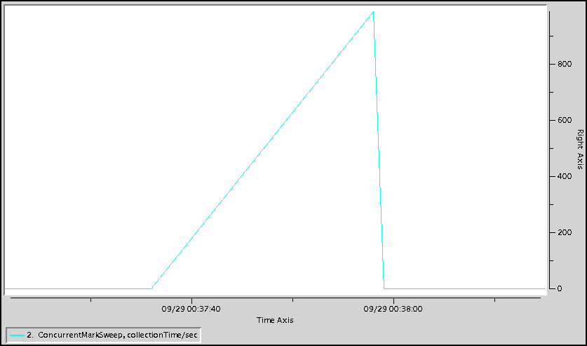
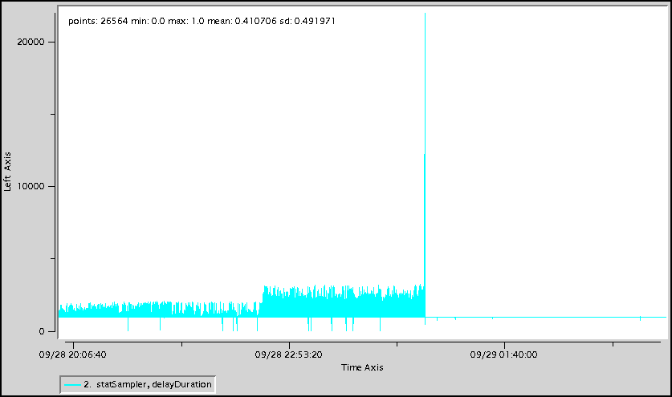

#Troubleshooting Garbage Collection Pauses
##Description
Garbage Collection (GC) frees objects that are no longer referenced by the Java application. There are several Java GC algorithms including Throughput (PS) and Concurrent Mark Sweep (CMS). The PS collector (the default) always and the CMS collector sometimes does what is known as a stop-the-world GC where it stops all application threads to clean up dead objects. This results in a GC pause. Long GC pauses have the potential to cause many issues with GemFire JVMs including client timeouts, members being kicked out of the distributed system, etc. It is always recommended to use the CMS collector with GemFire processes.
##Determination
There are several ways to see GC pauses. One is to enable GC debugging. Startup parameters like below can be added to the JVM to enable GC debugging. See the JDK documentation for additional details.

* -verbose:gc
* -Xloggc:gc.log
* -XX:+PrintGCDetails
* -XX:+PrintGCTimeStamps
* -XX:+PrintTenuringDistribution
* -XX:+PrintGCApplicationStoppedTime

The output from the GC debugging VM arguments is to show GC activity. For example, the -XX:+PrintGCApplicationStoppedTime VM argument shows application pauses. The output below shows a 7 second application pause.

	Total time for which application threads were stopped: 7.0117490 seconds
In addition, the -XX:+PrintGCDetails VM argument also shows pauses as shown below. The Full GC below paused the application for 21.73 seconds.

	2014-09-29T00:37:36.047-0700: 184053.420: [Full GC2014-09-29T00:37:36.048-0700: 184053.421: [CMS: 38824730K->18654967K(98566144K), 21.7356830 secs] 39078944K->18654967K(100453632K), [CMS Perm : 45938K->45360K(46208K)], 21.7391550 secs] [Times: user=20.94 sys=0.78, real=21.73 secs]
 
### vsd
Another way to see GC pauses is to use *vsd* to display the *VMGCStats collections* and *collectionTime* values as well as the *StatSampler delayDuration* and *jvmPauses* values contained in a given GemFire statistics archive.
####VMGCStats
The *vsd* chart below shows the *VMGCStats CMS collectionTime* values.

Logging the delta between the bottom left and bottom right of the line where it touches 0 shows a 23 second GC pause.

	Delta on {ConcurrentMarkSweep 19977} collectionTime
	  point1: 09/29 00:37:36, 0
	  point2: 09/29 00:37:59, 0
	  time delta =       23 seconds.
	  value delta =      0 Milliseconds / second.
	  value/time delta = 0.0 Milliseconds / second per second.
	  Of the 3 data points in this range:
	    the min is:     0.0
	    the max is:     987.954545455
	    the average is: 329.318181818
	    the stddev is:  570.395822765
####StatSampler
The *vsd* chart below shows the *StatSampler delayDuration* values. This statistic is set when the statistic sampler thread wakes up to sample statistics. It should be a fairly straight line at the statistic sampling interval. Spikes indicate that the thread didn't wake up at the normal time. This can be due to a number of things including high CPU, low memory and GC pauses. In this case, it spikes to >20 seconds.

The *vsd* chart below shows the *StatSampler jvmPauses* values. This statistic shows the *delayDuration* in a different way. Any time the *dalayDuration* is >3 seconds, this statistic is incremented.

It is also accompanied by a warning message in the GemFire log like:

	[warning 2014/09/29 00:37:57.792 PDT server <Thread-10 StatSampler> tid=0xb8] Statistics sampling thread detected a wakeup delay of 20,995 ms, indicating a possible resource issue. Check the GC, memory, and CPU statistics.
###gfsh
The *gfsh show metrics* command can be used to show the JVM statistics (including GCs) of a member. An example is:

	show metrics --member=server1 --categories=jvm

##Action
GC tuning can be difficult. The most important thing is to berify adequate heap headroom using the threshold JVM argument. Anywhere between 35% and 50% headroom is recommended to prevent heap fragmentation.

Some other areas to check are:

* Make sure the NewSize is correct
* Make sure PermGen is correct

See [[Sizing a GemFire Cluster]] for additional details.